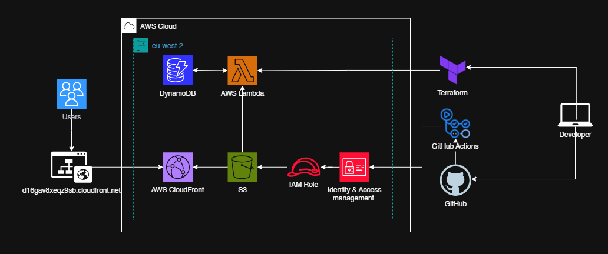

# 🌥️ AWS Cloud Resume Challenge

This is my take on the [Cloud Resume Challenge](https://cloudresumechallenge.dev/), a hands-on project designed to showcase cloud engineering skills through real-world infrastructure.

I built and deployed a **cloud-hosted resume website** using various AWS services and Infrastructure as Code (IaC) tools.

🔗 **Live Site**: [My Resume](https://d16gav8xeqz9sb.cloudfront.net/)

---

## 🚀 Tech Stack & AWS Services Used

- **Frontend**: HTML/CSS hosted on **Amazon S3**
- **Backend**: Python function using **AWS Lambda**
- **Database**: **Amazon DynamoDB** to track visitor count
- **API**: **Lambda Function URL** (no API Gateway used)
- **IAM**: Roles and policies to securely allow Lambda access to DynamoDB
- **CDN**: **Amazon CloudFront** to deliver content globally with low latency
- **IaC**: **Terraform** to provision Lambda and IAM resources
- **Version Control**: **GitHub**
- **CI/CD**: **GitHub Actions** to automate deployment and push changes to AWS

---

## 📁 Project Structure

---

## 💡 What I Learned

- Deploying serverless functions using **Terraform**
- Managing **IAM roles & policies** securely
- Hosting and distributing content via **S3 + CloudFront**
- Integrating **DynamoDB** as a lightweight NoSQL solution
- Setting up CORS and function URLs for simple APIs
- Using GitHub Actions for CI/CD and automating AWS deployments
- Using version control and working in a structured repo

---

## 🙌 Credits

Inspired by the original [Cloud Resume Challenge](https://cloudresumechallenge.dev/). Big thanks to the community for sharing amazing examples!

---

## 📬 Contact

Feel free to connect with me via [LinkedIn](https://www.linkedin.com/in/abdullah-tamki-b37063347) or [Email](mailto:abdullahaltamki@gmail.com)

